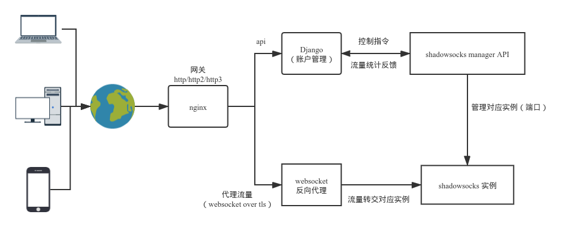

## ShadowStation Server

A Django based Shadowsocks server mananger.

- Restful API
- Mutiuser
- Websocket
- Traffic log

## Architecture




- Nginx: Gateway
- Django: Controller
- Shadowsocks: Proxy Server


## Usage

### Gateway

Use nginx as Gateway, example config see below:

```
server {
    listen 80;
    server_name example.com;
    # enforce https
    if ($http_x_forwarded_proto = 'http') {
        return 301 https://$host$request_uri;
    }
}

server {
    listen 443 ssl;
    server_name example.com;

    ssl_certificate      /path/to/cert;
    ssl_certificate_key  /path/to/key;
    ssl_ciphers          HIGH:!aNULL:!MD5;

    location /wss {
    	# proxy
        proxy_redirect off;
        proxy_pass http://127.0.0.1:$arg_id;
		# set header
		proxy_set_header Host $http_host;	
        proxy_set_header X-Real-IP $remote_addr;
        proxy_set_header X-Forwarded-For $proxy_add_x_forwarded_for;
		# websocket
        proxy_http_version 1.1;
        proxy_set_header Upgrade $http_upgrade;
        proxy_set_header Connection "upgrade";
    }
}

```

### Proxy Server

Use  [shadowsocks-libev](https://github.com/shadowsocks/shadowsocks-libev) as Proxy Server with manager API. Due to secure reson, use v2ray-plugin, all data will transport in wss (WebSocket Secure).

Recommended to user `Supervisor` as daemon.

- example config for ss-manager

```json
{
    "server":"localhost",
    "port_password": {
        "8080":"test"
    },
    "method":"chacha20-ietf-poly1305",
    "timeout":60,
    "reuse_port":false,
    "mode":"tcp_and_udp",
    "fast_open":true,
    "no_delay":true,
    "ipv6_first":false,
    "plugin":"v2ray-plugin",
    "plugin_opts":"server;fast-open;path=/wss;host=example.com"
}

```

No need to config tls for v2ray-plugin, cause Nginx did.


- example config for supervisor

```ini
[program:ss-manager]
command=ss-manager --manager-address 127.0.0.1:6001 -c /pat/to/ss-manager.json
autorestart=true
redirect_stderr=true
stdout_logfile=/path/to/ss-manager.log
stdout_logfile_maxbytes=5MB   
stdout_logfile_backups=10     
```


### Controller

- PROTOCOL

  - To list all ports:

    `http -a admin_account:password https://example.com/api/accounts/`  

  - To add a port:

    `http -a admin_account:password --json POST https://example.com/api/accounts/ port=ss_port secret=ss_password`   

  - To delete a port:

    `http -a admin_account:password DELETE https://example.com/api/accounts/id/ ` 

  - To update a port:

    `http -a admin_account:password PUT https://example.com/api/accounts/id/ port=ss_port secret=ss_password`  

